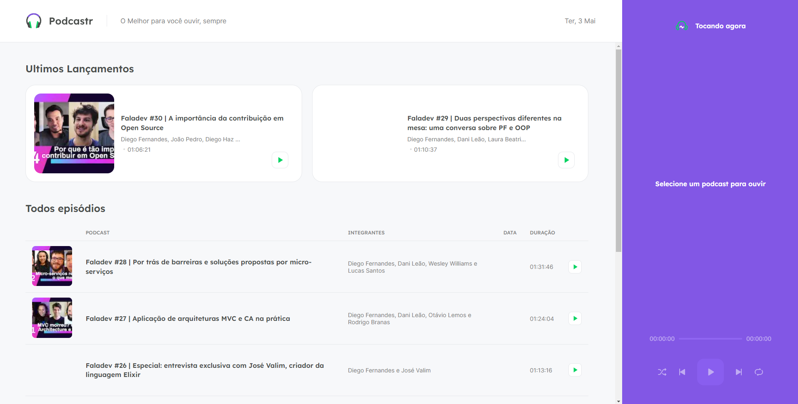
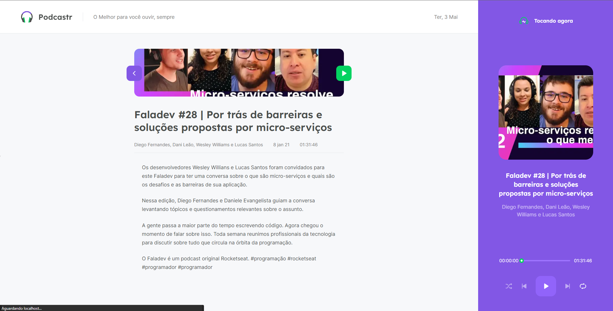

# RocketSeat-NLW6-React-NextJS

Projeto desenvolvido na 6º edição da Next Level Week da RocketSeat.

O projeto foi desenvolvido utilizando ReactJS e NextJS.

Foi desenvolvido uma aplicação Web a qual faz uma listagem de podcasts que são obtidos atráves de uma API que foi mockada utilizando o Json Server.

Quando é clicado em algum podcast ele é automaticamente enviado para o player que fica no lado direito da tela:
Neste player é possível dar play/pause, ir para o podcast anterior ou o próximo, colocar listagem dos proximos episódios de maneira aleatória.

É possível entrar nos capítulos dos podcasts para ter mais informações a respeito de cada capítulo.

A página inicial da aplicação ficou da seguinte maneira:

E o detalhamento:

